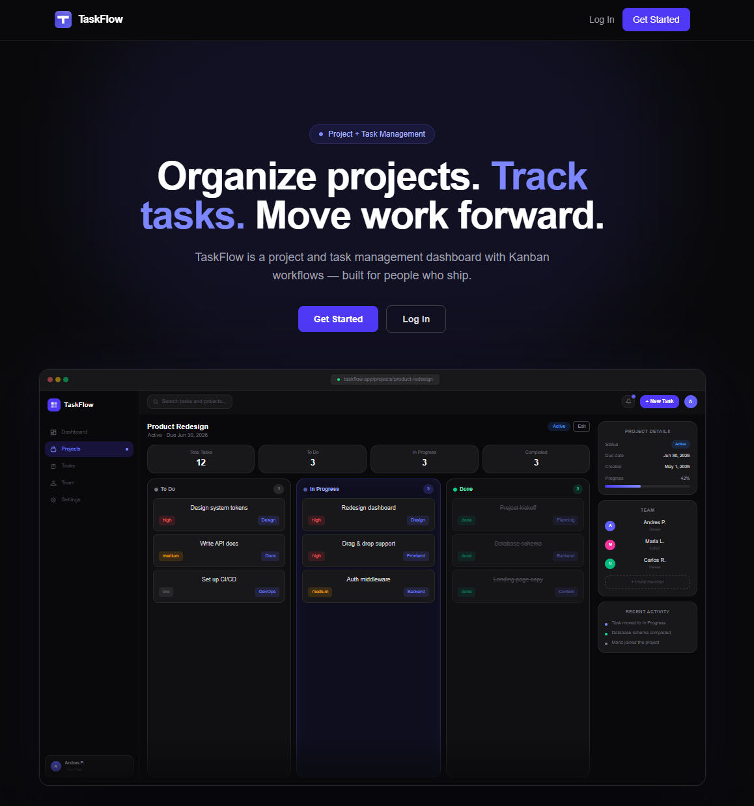
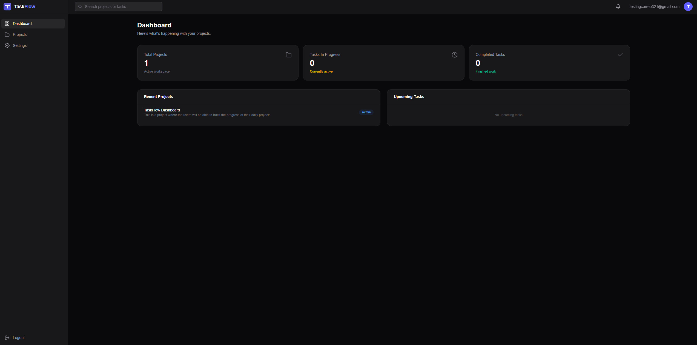
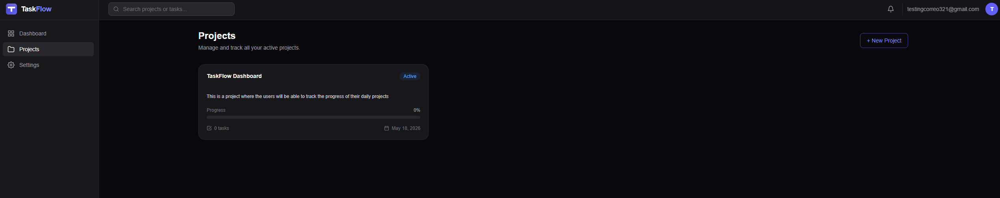
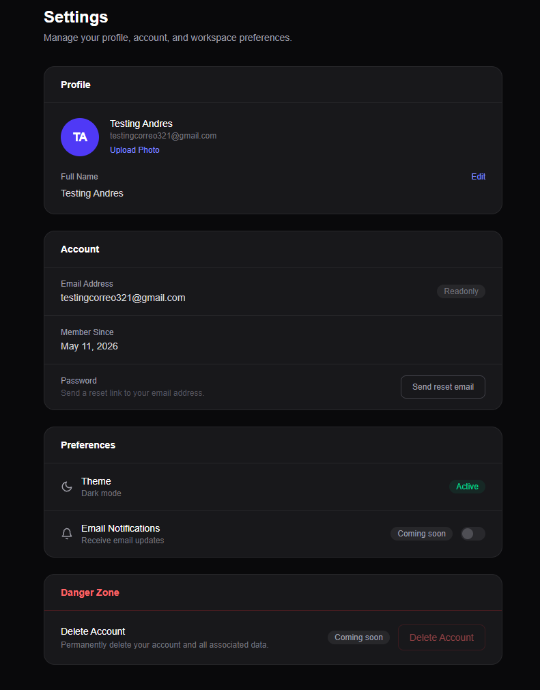

# TaskFlow

TaskFlow is a modern project and task management dashboard built with **Next.js**, **TypeScript**, **Tailwind CSS**, and **Supabase**. It allows users to create projects, manage tasks across workflow stages, collaborate with team members, and track project progress through a clean dark-mode interface.

**Live Demo:** https://taskflow-kappa-six.vercel.app/

---

## Overview

TaskFlow was built as a full-stack productivity application designed to help users organize projects and manage tasks more efficiently.

Users can create an account, sign in securely, create projects, add tasks, update task statuses, and collaborate by inviting other users to shared projects.

The project focuses on clean UI design, secure authentication, protected routes, relational database access, and real-world CRUD functionality.

---

## Screenshots






---

## Features

### Authentication

- User sign-up and login
- Protected dashboard routes
- Session handling with Supabase Auth
- Secure server-side authentication using Supabase SSR
- Auth-based route protection with Next.js proxy

### Project Management

- Create new projects
- View all owned and shared projects
- Edit project details
- Delete projects with confirmation
- Display project status, priority, and due date
- Separate owner and collaborator permissions

### Task Management

- Add tasks inside a project
- Assign task status:
  - To Do
  - In Progress
  - Done
- Set task priority:
  - Low
  - Medium
  - High
- Add task descriptions and due dates
- View tasks organized by project workflow columns
- Refresh project board after task creation

### Collaboration

- Invite collaborators by email
- Shared projects appear for invited users
- Team section displays:
  - Project owner
  - Collaborators
  - Names and emails when available
- Owner-only project actions
- Collaborators can view shared projects without owner-level controls

### User Settings

- View account information
- Update full name
- Persist profile data through Supabase
- Display profile name and email
- Disabled future features:
  - Email notifications
  - Delete account

### UI/UX

- Modern dark-mode dashboard
- Responsive landing page
- SaaS-style hero section and mockup
- Custom TaskFlow favicon/app icon
- Modal system with blurred background overlay
- Clean footer with GitHub, LinkedIn, and email links
- Mobile-friendly authenticated dashboard layout
- Responsive sidebar drawer with hamburger navigation on mobile

---

## Tech Stack

### Frontend

- Next.js
- React
- TypeScript
- Tailwind CSS
- Lucide React Icons

### Backend / Database

- Supabase
- Supabase Auth
- PostgreSQL
- Row Level Security policies

### Deployment

- Vercel

### Tooling

- Git
- GitHub
- VS Code
- npm

---

## Project Structure

```txt
taskflow/
├── public/
│   └── taskflow-icon.svg
│
├── src/
│   ├── app/
│   │   ├── dashboard/
│   │   │   └── page.tsx
│   │   ├── login/
│   │   │   └── page.tsx
│   │   ├── projects/
│   │   │   ├── [id]/
│   │   │   │   └── page.tsx
│   │   │   └── page.tsx
│   │   ├── settings/
│   │   │   └── page.tsx
│   │   ├── signup/
│   │   │   └── page.tsx
│   │   ├── icon.svg
│   │   ├── layout.tsx
│   │   └── page.tsx
│   │
│   ├── components/
│   │   ├── dashboard/
│   │   ├── landing/
│   │   ├── layout/
│   │   ├── projects/
│   │   ├── settings/
│   │   ├── tasks/
│   │   └── ui/
│   │
│   ├── hooks/
│   │   └── useToast.ts
│   │
│   ├── lib/
│   │   ├── config/
│   │   │   └── env.ts
│   │   └── supabase/
│   │       ├── client.ts
│   │       └── server.ts
│   │
│   ├── types/
│   │   ├── project.ts
│   │   ├── project-member.ts
│   │   └── task.ts
│   │
│   └── proxy.ts
│
├── .env.local
├── package.json
├── tailwind.config.ts
├── tsconfig.json
└── README.md
```

---

## Environment Variables

Create a `.env.local` file in the root of the project and add the following variables:

```env
NEXT_PUBLIC_SUPABASE_URL=your_supabase_project_url
NEXT_PUBLIC_SUPABASE_PUBLISHABLE_KEY=your_supabase_publishable_key
```

These values can be found in your Supabase project settings.

> Important: Do not expose or use the Supabase service role key in the frontend.

---

## Getting Started

### 1. Clone the repository

```bash
git clone https://github.com/aparedesp2003/Taskflow.git
```

### 2. Navigate into the project

```bash
cd Taskflow
```

### 3. Install dependencies

```bash
npm install
```

### 4. Add environment variables

Create a `.env.local` file and add your Supabase credentials:

```env
NEXT_PUBLIC_SUPABASE_URL=your_supabase_project_url
NEXT_PUBLIC_SUPABASE_PUBLISHABLE_KEY=your_supabase_publishable_key
```

### 5. Run the development server

```bash
npm run dev
```

Open the app in your browser:

```txt
http://localhost:3000
```

---

## Available Scripts

### Run development server

```bash
npm run dev
```

### Build for production

```bash
npm run build
```

### Start production server locally

```bash
npm run start
```

---

## Database Overview

TaskFlow uses Supabase PostgreSQL with relational tables for users, projects, tasks, profiles, and project members.

### Main Tables

#### `profiles`

Stores public profile information for authenticated users.

Typical fields:

```txt
id
full_name
email
```

#### `projects`

Stores project information.

Typical fields:

```txt
id
user_id
name
description
status
priority
due_date
created_at
updated_at
```

#### `tasks`

Stores tasks connected to projects.

Typical fields:

```txt
id
project_id
title
description
status
priority
due_date
created_at
updated_at
```

#### `project_members`

Stores collaboration access for shared projects.

Typical fields:

```txt
id
project_id
user_id
role
created_at
```

---

## Security and Access Control

TaskFlow uses Supabase Row Level Security to protect user data.

Access rules include:

- Users can view and manage their own projects.
- Users can view projects shared with them.
- Only project owners can edit or delete projects.
- Collaborators can view shared project details.
- Team member access is controlled through the `project_members` table.
- Profile updates are scoped to the authenticated user.

The project also uses Supabase SSR authentication with Next.js route protection.

---

## Route Protection

Protected routes include:

```txt
/dashboard
/projects
/projects/[id]
/settings
```

Unauthenticated users are redirected to:

```txt
/login
```

Authenticated users visiting auth pages are redirected to:

```txt
/dashboard
```

This behavior is handled through the Next.js `proxy.ts` file.

---

## Deployment

TaskFlow is deployed on Vercel.

### Deployment Steps

1. Push the project to GitHub.
2. Import the repository into Vercel.
3. Select Next.js as the framework.
4. Add the environment variables:
   - `NEXT_PUBLIC_SUPABASE_URL`
   - `NEXT_PUBLIC_SUPABASE_PUBLISHABLE_KEY`
5. Deploy the project.

After deployment, update Supabase authentication settings.

### Supabase Auth URL Configuration

Set the Site URL to the deployed Vercel URL:

```txt
https://your-vercel-url.vercel.app
```

Add redirect URLs:

```txt
https://your-vercel-url.vercel.app/**
http://localhost:3000/**
```

---

## Key Technical Challenges Solved

During development, several real-world issues were solved.

### Supabase RLS Recursion

A recursive Row Level Security policy caused projects to fail when fetching shared project data. This was fixed by restructuring the policies and using helper functions to safely check project ownership and membership.

### Supabase Auth Refresh Token Handling

Invalid refresh token errors were resolved by implementing the correct Supabase SSR authentication flow with the Next.js proxy convention.

### Next.js Middleware Migration

The project uses Next.js 16, where the old `middleware.ts` convention was replaced by `proxy.ts`.

### Modal Positioning

The task creation modal originally appeared too high on the screen. This was fixed by rendering the modal through a React portal into `document.body`, ensuring proper centering and full-screen overlay behavior.

### Profile Data Persistence

The Settings page originally failed to display saved profile names after refresh because it was querying a non-existing `avatar_url` column. The query was corrected to use only existing profile fields.

### Mobile Navigation

The authenticated dashboard layout was updated with a responsive mobile sidebar drawer, hamburger menu, overlay, and improved mobile spacing to prevent the sidebar from obstructing content.

---

## Future Improvements

Potential future enhancements include:

- Drag-and-drop task movement between columns
- Real email invitations for collaborators
- Email notification preferences
- Account deletion flow
- Activity history for projects
- Project analytics charts
- File attachments for tasks
- Comments on tasks
- Role-based permissions for collaborators
- Light mode theme
- Search and filtering for projects/tasks
- Calendar view for due dates

---

## Project Status

TaskFlow is live and actively maintained.

Current status:

```txt
Production deployed
Core features completed
Authentication working
Project and task management working
Collaboration working
Settings profile update working
Mobile layout working
```

---

## Author

Developed by **Andres Paredes**

- GitHub: https://github.com/aparedesp2003
- LinkedIn: https://www.linkedin.com/in/andresparedesp/
- Email: aaparedesp@outlook.com

---

## License

This project is available for portfolio and educational purposes.
